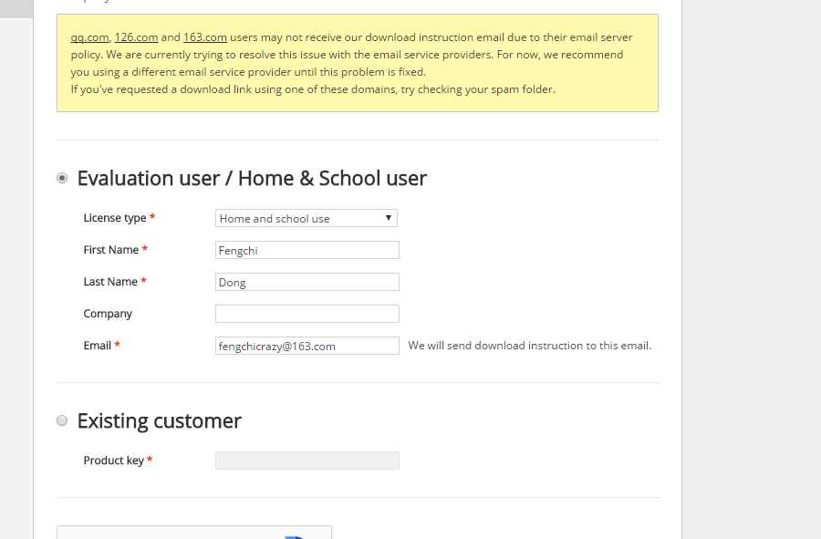
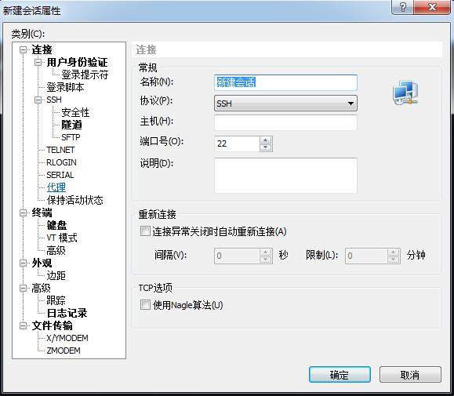
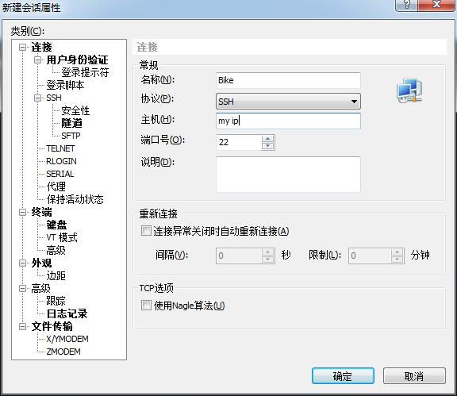
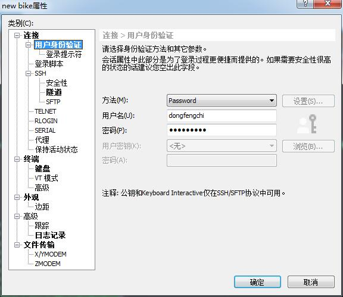
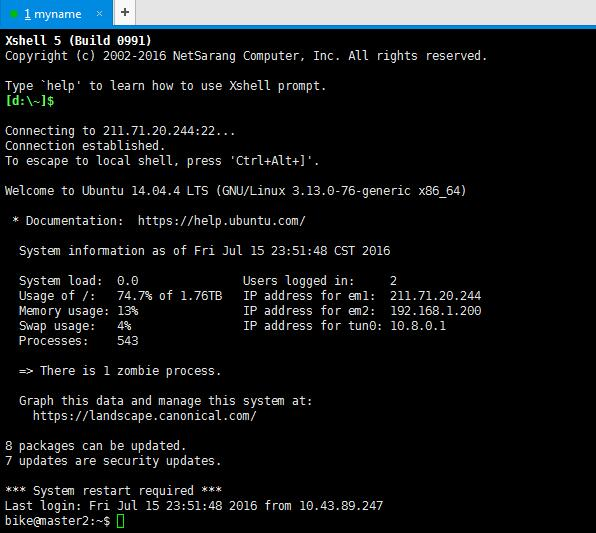
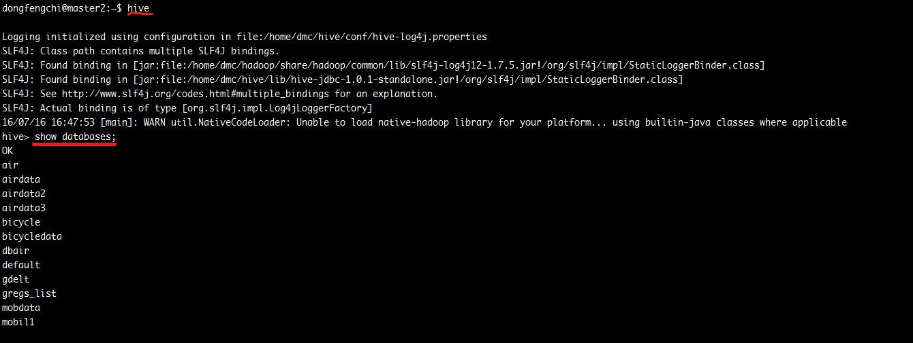
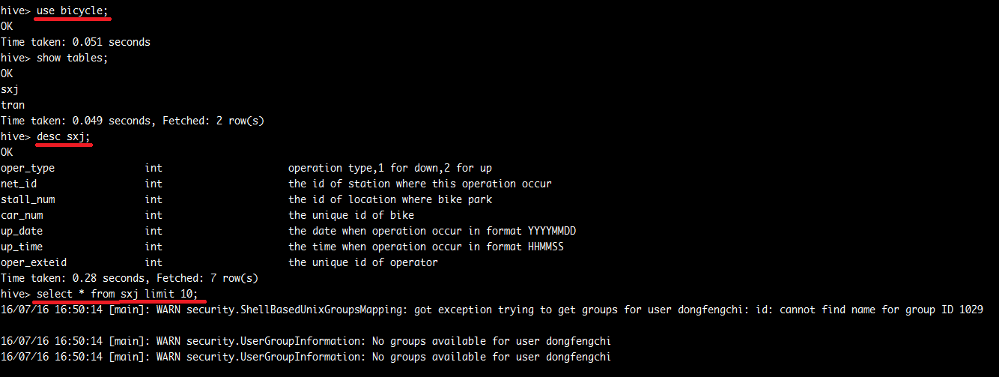
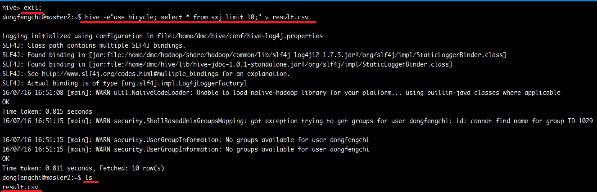
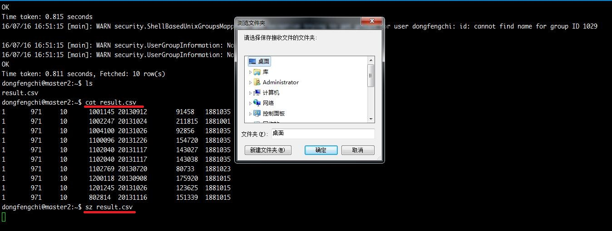

#  自行车项目快速入门

本文档是为了帮助您从服务器Hive上快速上手获得数据。至于进一步的分析，您可以自行定制需要的数据，清洗数据之后建模分析。

涉及到的软件有：Xshell, Linux的一些初级指令, Hive。

## 1. Xshell

### 1.1 Xshell 简介

由于我们的数据存储在服务器上的，要从本地访问的话需要借助一定的工具。Xshell 是一个终端模拟软件，它的作用在于在本地电脑远程登服务器。当然还有很多的同类的产品，比如SecureCRT等。甚至还可以通过本地的ssh命令实现登录。他们的最终效果都是一样的，就是登录远程服务器后进行操作。这里我们只选择Xshell进行介绍。

### 1.2 Xshell 下载与安装

搜索引擎搜索Xshell，可以得到Xshell的[下载页面](http://www.netsarang.com/download/down_xsh.html)选择下方的下载链接后，可以进入正式的下载页面。

正式的下载页面中会有两个选择：`Evaluation user / Home & School user` 以及 `Existing customer`。Xshell对家庭和学校客户是免费的，只需选择上面一项，将License type 修改为`Home and School use`即可。填写带星号的必填项之后，选择提交。如下图所示：

*Notice:* Email地址为接收下载链接地址，请务必正确填写。网页上提到qq.com和163.com,126.com的邮箱可能会出现接收不到邮件的问题。我用的是163的邮箱，并没有出现什么问题。大家如果没有接收到邮件，不妨换一个邮箱试试看。

登录刚才填写的email地址可以找到一个下载页面的连接，点击即可完成下载。

安装Xshell比较简单，像所有windows程序安装一样，比较傻瓜化，这里就不多介绍了。注意有一个页面要选择Home & School use即可。

### 1.3 配置Xshell连接服务器

安装完成后打开Xshell，会弹出一个会话窗口，点击左上角新建。如果没有弹出也不要紧，在左上角文件菜单中也可以找到`新建`。新建窗口如下图所示：

在左边窗口选择`连接`，需要填写的是右侧的信息。
- 名称(N): 自己对会话的命名，自己看着舒服即可
- 协议(P): 选择SSH
- 主机(H): 服务器的ip地址
- 端口号(O): 连接服务器端口号，使用默认值22即可
填写完成之后如下图所示：

还需要设置用户身份。选择左侧窗口的第二项`用户身份验证`，在右边窗口输入连接账户的用户名和密码即可。

点击确定，即可保存刚刚创立的会话。选中会话，点击连接，就可以连接服务器了。连接成功的界面如下图所示：

*Tips:* 可以在Xshell上部菜单中自行设置登录界面的字体格式，字体大小以及配色方案。让整个界面更加美观舒适。

## 2. Linux常用命令简介

在Xshell登录成功之后，进入的界面实际上是远程服务器的命令行。存放数据的Hive也是存放在服务器上的，要进入它得到数据也是需要敲击命令行。目前我们使用的服务器操作系统是Ubuntu 14.04.4 LTS，是Linux众多发行版中的一种。不了解这个并没有关系，只需要知道我们进入了一个Linux系统，需要使用一些Linux下的常用命令即可。

下面对常用命令做一简单介绍：

### 2.1 Linux常用命令

下面表格只列出最常用的几个Linux命令，使用过程中遇到问题或者想更进一步的了解，请借助搜索引擎。

| 命令关键词 | 主要功能 | 用法规范 | 示例 |
| ---------- | -------- | -------- | ---- |
| `ls` 或 `ll` | 查看当前目录下的所有文件， `ll`可理解为详细版`ls` | | |
| `pwd` | 查看当前路径位置 | | |
| `clear` | 清空屏幕，或者使用快捷键`Ctrl-l` |
| `mkdir` | 在指定文件目录下创建空文件夹 | `mkdir 文件路径` | `mkdir myfolder` |
| `cd` | 进入指定目录文件夹 | `cd 文件路径` | `cd myfolder` |
| `mv` | 移动文件(剪贴)，或重命名文件 | `mv [-r] 原文件 新文件`  (-r表示对目录操作) | `mv folder1/res.txt folder2/res.txt` 或 `mv old.txt new_name.txt` |
| `cp` | 复制文件 | `cp [-r] 原文件 新文件`  (-r表示对目录进行操作) | `cp folder1/res.txt folder2/res.txt` 或 `cp old/* new/` (复制old下所有文件到new下) |
| `rm` | 删除文件 *Linux 删除不可恢复，慎用！* | `rm [-rf] 待删除文件`  (-r 表示目录，-f表示不经询问强制删除(*慎用!*)。)| `rm res1.txt` | 
| `vi` 或 `vim` | 使用vim编辑器，下文详述 | `vi 待编辑文件` | `vi test.py` |
| `cat` | 查看文件 | `cat 待查看文件` | `cat res.txt` |
| `head` | 查看当前文件开头部分 | `head 待查看文件` | `head res.txt` |
| `tail` | 查看当前文件结尾部分 | `tail 待查看文件` | `tail res.txt` |  
| `sz` | 下载指定文件到本地 | `sz 文件1 [文件2]` (即sz后可跟多个文件) | `sz result.txt` (使用`sz *` 下载当前目录下所有文件) 
| `rz` | 上传文件到当前目录 | 不须要指定上传文件名，使用完成该命令后会弹出窗口 | |

基本上常用的Linux命令就是这些，掌握这些命令，基本上就能应付一大半的日常工作需要了。更进一步的Linux命令如`awk`, `sed`和 `grep`，感兴趣的同学可以自行了解。

*tips:*第一次登陆个人账号时，建议修改密码，命令行下输入`passwd`即可。在Linux系统下输入的密码是不可见的，所以自己注意不要输错了哦~

### 2.2 vim简介

我们可以把从Hive导出的数据(方法下文详述，文本格式，通常较大)通过`sz`的方法下载至本地，再写`python`或`R`等脚本进行数据清洗和分析。也可以在服务器直接写`python`或`R`程序进行上述操作，可以省略中间的上传下载步骤，节省时间。

若想在服务器写脚本，就要借助到一款服务器端的文本编辑器。`vim`就是这样一款强大的编辑器。可以用它进行查看，编辑文件等操作。

`vim`被称为“编辑器之神”。它的全部操作都可以在大键盘上实现，不需要使用鼠标和小键盘，熟悉操作之后双手不必离开键盘，进而提升效率。`vim`的学习曲线很陡峭，对于习惯了在windows下的文本编辑器操作的同学而言，可能刚开始会很不适应。但是当最开始的难关过去之后，会发现这个编辑器没那么难用了:joy:。学习`vim`的原因在于很多追求稳定而没有装图形界面的服务器上，`vim`似乎是唯一的选择。而对企业用户而言，他们追求稳定大于一切，所以就是喜欢这种非常稳定不需要图形界面的服务器。所以学好`vim`对工作还是有一些帮助的。

如果对`vim`编辑器感兴趣，可以参考下列几篇教程：

- 英文好的同学，可以参考`vim`的官方教程：直接在服务器端命令行下输入`vimtutor`即可
- 还有许多使用者自己写的教程，比如这篇[Learn Vim Progressively](http://yannesposito.com/Scratch/en/blog/Learn-Vim-Progressively/)，它的中文版在[这里](http://blog.csdn.net/niushuai666/article/details/7275406)
- 另一篇[英本版教程](https://danielmiessler.com/study/vim/)和它的[中文翻译](http://blog.jobbole.com/86132/)
- 关于`vim`的进阶操作，有一本很好的教程叫做《vim实用技巧》([豆瓣](https://book.douban.com/subject/25869486/))
- 如果这些都不能满足你了，你可以探索一下vim的浩如烟海的插件，借助搜索引擎搜索"vim 打造 IDE"即可。

关于编辑器的选择，没有优劣，选择自己用的顺手的即可。

## 3. Hive

### 3.1 Hive简介

Hive是基于Hadoop的一个数据仓库工具。像其他数据库一样，Hive也可以通过SQL语句实现查询功能。它背后的原理是把SQL语句转化为MapReduce任务进行运行。对于第一次接触Hive但是有MySQL基础的同学，把它理解为一个分布式的MySQL并不会对实际使用造成太大的影响。尤其我们现在数据库的创建和整理已经完成，只需要从中找到我们需要的数据，即使用`SELECT` 语句，加一点`WHERE`条件和`GROUP BY`分组，那和MySQL更是基本一样。

(如果没有了解过SQL语句，推荐[W3School的SQL教程](http://www.w3school.com.cn/sql/index.asp)，简单明了。现阶段我们只会设计到从数据库中读取文件，所以请重点关注以下几个关键词的语法`select`,`where`,`group by`,`distinct`,`limit`,`order by`。如果涉及到多表查询(我们现在应该用不太到),请关注`join`。)

唯一的不同就在于，Hive的运行会比较慢。对于习惯了一两秒内就看到结果的MySQL的同学而言，Hive稍微加一点条件的查询就可能需要一两分钟才能得到最终结果。Hive这一点是它的特性所致，它的数据容量更大，而且不像MySQL会随着数据量的增加而线性增加运行时间。Hive对10G的和100G的数据处理时间不会相差太多，而MySQL可能就没法带动100G的数据了。所以Hive是对大数据量的一种解决方案，小数据量时还是使用MySQL比较好。

### 3.2 通过Hive获取自行车数据

下面通过一个例子来讲述一下Hive获取自行车数据的过程。

| 序号 | 语句 | 解释 |
| :----: | ---- | ---- |
| 1 | 在命令行中输入`hive`，进入Hive界面 | Hive环境下输入的是SQL语句，以`;`作为语句的结尾标志，意味着每一条语句必须用`;`结尾，但也可以利用这一特性进行多行输入 |
| 2 | `show databases;` | 查看服务器的数据库 | 
| 3 | `use bicycle;` | `use databasename` 选择使用bicycle数据库,必须选定了database之后才能对table进行操作 |
| 4 | `show tables;` | 查看选中数据库中所有表 |
| 5 | `desc sxj;` | `desc tablename` 查看tablename中变量详细信息 |
| 6 | `select * from sxj limit 10;` | 查询语句，可以自行定义。这一步可以理解为测试，找到自己需要的数据集，为后面导出文件做准备 |
| 7 | `exit;` | 退出Hive，进入Linux命令行，进行文件导出操作 |
| 8 | `hive -e"use bicycle; select * from sxj limit 10;" > result.csv` | 注 |

注：最后这条语句有点复杂，但是却是把Hive结果导出文件的核心操作。所以我们详细看一下这条语句：

1. `hive`是这条语句的核心，标明这条命令是由Hive执行的。
2. `-e "..."` 在Linux的世界中，命令之后的`-`都可以理解为该命令的`选项`。几乎每一个Linux的命令都有选项，之前的表格中的Linux命令也都有，有兴趣的同学可以自行搜索。在这条语句中 `-e`的意思是其后双引号`""`中的语句为交给Hive执行的查询语句。所以我们这里输入了刚才在测试时候输入的`use bicycle; select * from sxj limit 10;`(注意不要忘记`;`)。因为在命令行下通过`hive -e""`语句进行查询，每次都需要进入Hive，而进入Hive通常会比较慢，所以我们最好先在Hive中测试语句没有问题了，确定是自己想要的了，再进行文件导出操作。Hive中还有很多选项，可以通过`hive -H`查看，然后自己试试看是干什么用的。
3. 事实上查询语句到这里就可以结束了。如果不标注后面的`> result.csv`命令也是可以正常运行的。你可以试试看。
4. 结果发现查询结果被打印在了屏幕上！你可使用复制粘贴(在Xshell中复制和粘贴的快捷键分别是`Ctrl+Insert`和`Shift+Insert`)把结果粘贴到你想要的文件中。但这样当然不够好了，有没有更简单的方法呢？
5. `> result.csv` 就是这样一种方法。`>`实际上是Linux系统中输出重定向的一个符号，它能把原来打印在屏幕上的内容输出到文件中。`result.csv`就是我们用来接收输出的一个文件。`>`可以理解为写入模式，如果之前不存在这个文件，那么这个文件将会被创建；如果之前存在这个文件，那么这个文件将会被新的内容覆盖。所以一定要注意不要把自己之前的文件覆盖掉了！
6. 至于接收文件的文件名，我们这里选择了`result.csv`，其实并没有太大关系，自己可以随意起一个好记的名字，比如`result_fengchi`也可以，它们都是保存结果的文本文件。导出的文件列与列之间是用`'\t'`分隔符进行分隔的。与Windows不同，Linux中文件并没有特别强的扩展名的概念，相同扩展名的文件只是为了提醒他们是同一个类型的。比如`csv`就代表他们是有分隔符的表格形式。
7. 所以`hive -e"..." > result.csv`这条语句的意思就是告诉Hive执行语句`...`，并把结果写入`result.csv`文件中。
8. 之后就可以下载文件`sz result.csv`或者直接在服务器上写脚本进行数据清洗的操作啦！
9. 如果在Windows环境中编辑下载下来的文本文件`result.csv`，为避免不必要的错误，请不要使用Windows自带的文本编辑器(原因是因为windows喜欢自作聪明对UTF-8编码的文件增加一个BOM头，导致文件兼容性有问题。[参考](https://www.zhihu.com/question/20650946))。推荐两款轻量级的文本编辑器Sublime Text([主页](http://www.sublimetext.com/))或Notepad++([主页](https://notepad-plus-plus.org/))。他们也可用来写代码。如果实在不想下载，请使用`开始->附件`中的`写字板`打开文件进行编辑。

我自己操作的截图如下：

到这里从Hive导出数据的任务已经完成。接下来就是大家自行发挥的时刻了！

**Attention**
- 我们自行车数据的存放在`database`名叫`bicycle`下，还有一个`bicycledata`是数据预处理时候用的，我们现在不会用到了。
- `tran`表中时间字段格式是用`int`格式存储的，在进行数据清洗的时候可能需要补0。默认的时间格式是`%H%M%S`，即正常情况下的11:46:32会被存储为114632，但如果是00:06:32则会被存储为632。在数据清洗写程序进行时间转化时，需要在这个字段前补0。补到6位为止。即把632 -> 000632。然后再进行时间格式转化即可。日期字段不会有这个问题。
- 目前在database里只有`tran`交易流水表和`sxj`上下架表。其他的两个数据表，各站点经纬度信息的数据表存放在服务器`/home/dmc/project/bike`目录下`四大区域点位清单2506处 2014.11.13.xls`中的`sheet1`中，需要注意的是并不是每一个有交易记录的站点都能找到对应的经纬度。杭州天气的数据是王高斌师兄写爬虫爬下来的，目前在他的github下，[链接](https://github.com/GaobinWang/Crawler/blob/master/Weather/Result.csv)

### 3.3 Hive语句的进阶教程

王高斌师兄之前写过一个简明版的进阶教程，存放在他的github下。想进一步了解Hive的同学可以看一看。下面是连接

<https://github.com/GaobinWang/LearnHive>

